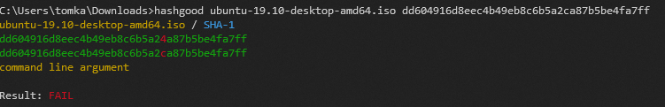
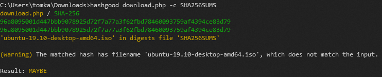

# hashgood
A CLI tool for easily verifying a downloaded file's checksum.

Wouldn't it be nice if your computer compared the hash for you?




Read the MD5, SHA1 or SHA256 hash from:

* Command line argument
* SHASUMS-style check files (`-c`)
* Raw hash in a file/STDIN (`-c`)
* The clipboard (`-p`)

...or just run `hashgood` against the input and receive all three at once.

This program arose from dissatisfaction with the [workarounds required for traditional tools](https://thomask.sdf.org/blog/2019/05/05/techniques-for-verifying-shasums-conveniently.html).

## Installing

If you have a working Rust toolchain you can install `hashgood` from crates.io:

```
cargo install hashgood
```

Pre-compiled binaries for common platforms can be downloaded [from the releases page](https://github.com/thombles/hashgood/releases). Otherwise you can build it yourself; see the next section.

## Compiling

`hashgood` targets stable Rust. With a Rust toolchain installed, clone the repository and run:

```
cargo build --release
```

Take the compiled executable from `target/release/hashgood`.

To include support for pasting from the clipboard with `-p`, specify the extra feature. Note that on Linux this requires several extra libraries: `libxcb1-dev libxcb-xfixes0-dev libxcb-shape0-dev libxcb-render0-dev`

```
cargo build --release --features paste
```

## Goals

* Be forgiving and deliver what the user wants with a minimum of fuss. They just want to check this hash, damnit.
* Don't let users be tricked - be explicit about checksum types and the sources of those checksums that are being compared.
* As much cross-platform support as is practical.

## Non-goals

* Scriptability. This is an interactive tool.
* Support for any unusual scenarios that could compromise smooth operation. (e.g., text mode, uncommon hash types)

## Future ideas

* Nominate a default (downloads) directory and auto-select the most recently created file in that directory as input.
